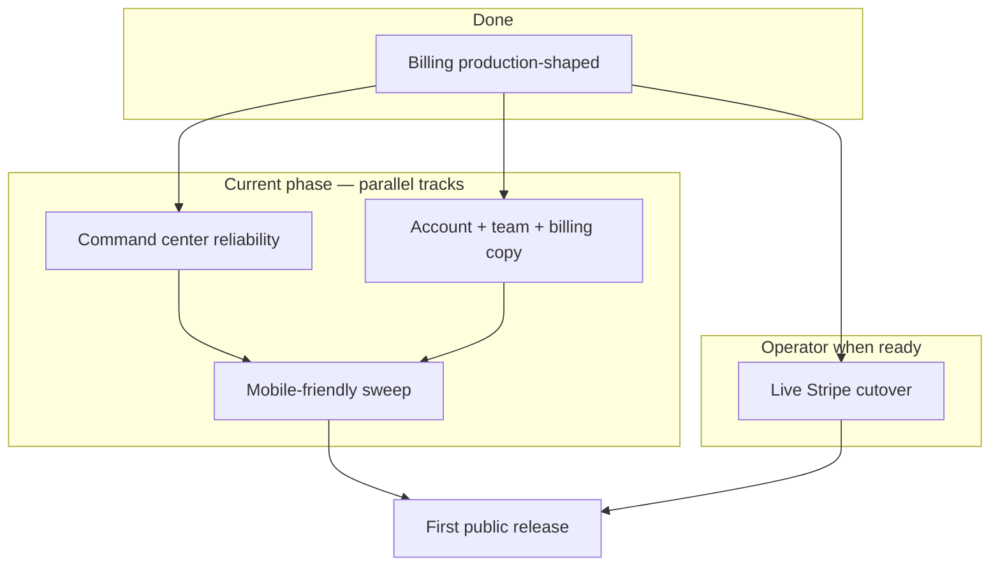

# Launch phase — product readiness (post-billing)

**Hub:** [`LAUNCH_READINESS.md`](LAUNCH_READINESS.md) · [`BILLING_SHIP_NOTE.md`](BILLING_SHIP_NOTE.md)  
**Team brief (email/Slack):** [`LAUNCH_PHASE_TEAM_BRIEF.md`](LAUNCH_PHASE_TEAM_BRIEF.md)

---

## Narrative (paste-ready)

SmartFarm has crossed the hardest engineering gate: billing is now production-shaped, Stripe is the source of truth for subscriptions, and Farm Pro access can be granted and revoked safely. The remaining launch work is to make the product feel dependable in daily use, especially for farms that live on unreliable connectivity and small screens.

**The first track is the command center.** SmartFarm’s “today” and “this week” views need to stay trustworthy even when the connection drops. That means verifying offline capture, replay, and reconnect behavior end to end on a real account like `sfarm663@gmail.com`, and confirming that checklists, priorities, and tasks stay accurate after a day of normal use. When farmers open the command center each morning, it should reflect reality without them having to wonder if something went missing while they were offline.

**In parallel, the account, team, and billing experience** needs to say plainly what is already true in the backend. Farmers should always know what plan they’re on, when they renew, what happens if a payment fails, and how to get help. This phase sharpens the copy for plan/renewal/failure states, adds a short “How billing works” blurb and clear support links, and walks a real farm team through Run 2 so the invite and upgrade paths match how teams actually adopt SmartFarm.

**The third track is a mobile-focused pass on the web app.** SmartFarm doesn’t need a separate native app before launch, but it does need to feel intentional on a 375-pixel screen. The goal is a focused sweep of the dashboard and subscription pages to ensure text is readable, tap targets are comfortable, and the “today on farm” and billing surfaces are easy to use one-handed. This is a layout and spacing pass, not a redesign or fork of the product.

When these three tracks are complete, SmartFarm will be ready for its first public release: billing that can safely run in live mode, a command center farmers can rely on every day, and a dashboard that works naturally on both desktop and mobile. After that, the roadmap shifts from launch readiness to learning — watching real farms move through trials, upgrades, and renewals, and iterating based on what they actually use in the field.

---

## Phase map



| Track | Focus | Primary doc |
|-------|--------|-------------|
| **A. Command center** | Offline queue, reconnect, checklist/priority freshness | [`command-center-verification.md`](post-deploy-notes/command-center-verification.md) |
| **B. Account & team** | Billing copy polish, team sync on spotty connectivity | [`farm-team-invitations.md`](post-deploy-notes/farm-team-invitations.md) · [`BILLING_SHIP_NOTE.md`](BILLING_SHIP_NOTE.md) |
| **C. Mobile web** | 375px pass on dashboard + subscription pages | This doc §3 |
| **D. Live cutover** | Operator-only when A–C are acceptable in test/live | [`BILLING_LIVE_CUTOVER_CHECKLIST.md`](BILLING_LIVE_CUTOVER_CHECKLIST.md) |

Tracks A, B, and C can run **in parallel**. Live cutover (D) can happen when billing UX is sharpened, even while command center hardening continues.

---

## 1. Command-center reliability

**Intent:** Checklists, priorities, and “today on farm” never feel out of date — online or after reconnect.

### Verify

Preferred smoke account: **`sfarm663@gmail.com`** (Nabainimua farm). See [`command-center-verification.md`](post-deploy-notes/command-center-verification.md).

| Check | Pass criteria |
|-------|----------------|
| Today / week command center loads | Real data, attention items, financial strip |
| Weekly priorities + today’s checklist | Match API after refresh |
| Log revenue offline → reconnect | Write replays; command center updates |
| Feed-mix / queued writes | Idempotent replay via `offline-write-queue.js` |
| Navigate from command center offline | Document failures (e.g. Crop Management) — fix or document limit |
| Spotty connectivity session | Priorities/tasks stay consistent after reconnect |

### Probes

```powershell
node backend/scripts/command-center-production-probe.js
# With creds:
$env:SMARTFARM_SMOKE_EMAIL="sfarm663@gmail.com"
$env:SMARTFARM_SMOKE_PASSWORD="..."
node backend/scripts/command-center-production-probe.js
```

### Known gaps (2026-06)

- Revenue did **not** save offline in manual test  
- Offline navigation to linked pages (e.g. Crop Management) failed  
- Mobile layout not verified at ≤768px  

---

## 2. Account, billing UX, and farm team

**Intent:** Farmers always know *what plan am I on, when do I renew, and what happens if payment fails?* Team flows match how farms actually work.

### Billing foundations (shipped)

Status badges, renewal labels, failed-payment banners, Customer Portal — see [`BILLING_SHIP_NOTE.md`](BILLING_SHIP_NOTE.md).

### This phase — sharpen copy and trust

| Item | Target |
|------|--------|
| Dashboard billing chip / banner | Plan + renewal or past-due visible without opening billing page |
| `subscription-management.html` | Short **“How billing works”** blurb (trial → Farm Pro, Portal cancel, retry behavior) |
| Support path | Clear link to contact/help on billing page and past-due banner |
| Upgrade / cancel / past-due copy | Predictable tone — no surprises; align with Stripe Portal behavior |
| `POST /cancel` | Already routes to Portal (`USE_BILLING_PORTAL`) — UI never implies instant cancel |

### Farm team (real account)

Account: **`sfarm663@gmail.com`**. Checklist: [`farm-team-invitations.md`](post-deploy-notes/farm-team-invitations.md).

| Check | Pass criteria |
|-------|----------------|
| Invite member | Email received; accept flow works |
| Role / farm access | Invitee sees correct farm data |
| Weekly checklist + priorities with team | Stay in sync after reconnect |
| Expired-trial gate | Upgrade path works with billing enabled |

---

## 3. Mobile-friendly sweep (focused pass, not redesign)

**Intent:** Same features and APIs — tuned for **375px** and one-handed use. No native app on day one.

### Scope

| Page / surface | Criteria |
|----------------|----------|
| `dashboard.html` | Readable cards; command center panel scrolls; no horizontal overflow |
| Command center | Today view + active tasks easy to tap; period switcher usable |
| `subscription-management.html` | Badges, buttons, Portal CTA tap-sized (≥44px) |
| Trial / billing banners | Readable on narrow viewport; actions stack vertically |
| Nav / primary actions | [`dashboard-primary-actions.md`](qa/dashboard-primary-actions.md) at mobile width |

### How to test

1. Chrome DevTools → iPhone SE / 375×667  
2. Login → dashboard → command center → subscription management  
3. Re-run offline/reconnect spot-check at mobile width  
4. Re-run billing banner check (trial ending, past_due if simulatable)  

**Out of scope this pass:** native app, Capacitor shell, PWA install prompt.

---

## 4. Definition of done (first public release)

**Paste-ready (tickets / milestones):**

> First public release is done when: (1) command center reliably reflects “today” and “this week” even with offline/reconnect on a real farm account, (2) farmers can clearly see their plan, renewal date, and what happens on payment failure, with a working Stripe Customer Portal path, and (3) the main dashboard and subscription pages feel natural to use on a 375px phone screen (readable text, sane layout, tap-sized actions).

| Pillar | Verify |
|--------|--------|
| **1. Command center** | Offline capture + replay + reconnect on `sfarm663@gmail.com`; checklists/priorities accurate after a day of use — [`command-center-verification.md`](post-deploy-notes/command-center-verification.md) |
| **2. Account & billing** | Plan, renewal, failure copy; Portal works; support links + “How billing works” — [`BILLING_SHIP_NOTE.md`](BILLING_SHIP_NOTE.md) |
| **3. Mobile web** | Dashboard + `subscription-management.html` at 375px — readable, tap-sized, one-handed “today” + billing |

**Operator (when taking real money):** live Stripe cutover signed off — [`BILLING_LIVE_CUTOVER_CHECKLIST.md`](BILLING_LIVE_CUTOVER_CHECKLIST.md)

---

## 5. After launch

- Watch real usage: command center daily opens, upgrade funnel, failed-payment recovery  
- Iterate from farmer feedback — not new launch blockers  
- Native app only if mobile web still feels limiting after 4–8 weeks of use  

---

## Quick links

| Doc | Use |
|-----|-----|
| [`BILLING_SHIP_NOTE.md`](BILLING_SHIP_NOTE.md) | Deploy billing; what shipped |
| [`BILLING_LIVE_CUTOVER_CHECKLIST.md`](BILLING_LIVE_CUTOVER_CHECKLIST.md) | Live Stripe switch |
| [`command-center-verification.md`](post-deploy-notes/command-center-verification.md) | Command center runs |
| [`farm-team-invitations.md`](post-deploy-notes/farm-team-invitations.md) | Team invite verification |
| [`POST_DEPLOY_NOTES.md`](../POST_DEPLOY_NOTES.md) | Deploy hub |
