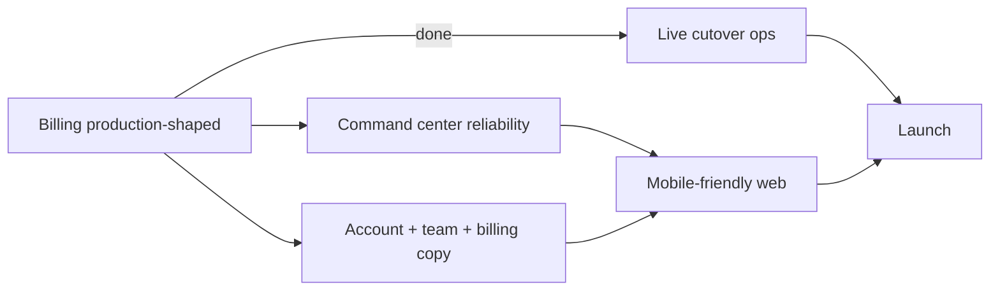

# SmartFarm launch readiness — final refinement stage

**Status (2026-08):** End-of-month ship target **2026-08-31**. Day-by-day runway, gap→task map, and ship checklist: **[`RELEASE_RUNWAY_AUG2026.md`](RELEASE_RUNWAY_AUG2026.md)**.

**Status (2026-07):** Billing is **production-shaped** ([`BILLING_SHIP_NOTE.md`](BILLING_SHIP_NOTE.md)). Current focus: **command center reliability**, **account/team UX**, and **mobile-friendly web** — see [`LAUNCH_PHASE_PRODUCT.md`](LAUNCH_PHASE_PRODUCT.md).

**Related docs:**

| Area | Doc |
|------|-----|
| **August release runway (primary)** | [`RELEASE_RUNWAY_AUG2026.md`](RELEASE_RUNWAY_AUG2026.md) |
| **Product launch phase** | [`LAUNCH_PHASE_PRODUCT.md`](LAUNCH_PHASE_PRODUCT.md) |
| **Team brief (email/Slack)** | [`LAUNCH_PHASE_TEAM_BRIEF.md`](LAUNCH_PHASE_TEAM_BRIEF.md) |
| **Billing ship note** | [`BILLING_SHIP_NOTE.md`](BILLING_SHIP_NOTE.md) |
| Live cutover | [`BILLING_LIVE_CUTOVER_CHECKLIST.md`](BILLING_LIVE_CUTOVER_CHECKLIST.md) |
| Billing (test → live) | [`BILLING_PRODUCTION_ACTIVATION.md`](BILLING_PRODUCTION_ACTIVATION.md) |
| Billing verification log | [`post-deploy-notes/stripe-billing-flow.md`](post-deploy-notes/stripe-billing-flow.md) |
| Command center | [`post-deploy-notes/command-center-verification.md`](post-deploy-notes/command-center-verification.md) |
| Farm team invites | [`post-deploy-notes/farm-team-invitations.md`](post-deploy-notes/farm-team-invitations.md) |
| Deploy hub | [`../POST_DEPLOY_NOTES.md`](../POST_DEPLOY_NOTES.md) |

---

## Phase overview



| Phase | Status | Focus |
|-------|--------|--------|
| **Billing (test + UX foundations)** | ✅ Complete | Stripe sync, Portal, badges, failed-payment UI — [`BILLING_SHIP_NOTE.md`](BILLING_SHIP_NOTE.md) |
| **Live billing cutover** | 🔲 Operator | Live keys, descriptor, one real payment — [`BILLING_LIVE_CUTOVER_CHECKLIST.md`](BILLING_LIVE_CUTOVER_CHECKLIST.md) |
| **Command center + offline** | 🔲 In progress | Reconnect, today/week accuracy — [`LAUNCH_PHASE_PRODUCT.md`](LAUNCH_PHASE_PRODUCT.md) §1 |
| **Account, team, billing copy** | 🔲 In progress | Trust copy, support links, farm-team on `sfarm663@gmail.com` — §2 |
| **Mobile-friendly web** | 🔲 Next | 375px sweep — §3 |

**Full narrative:** [`LAUNCH_PHASE_PRODUCT.md`](LAUNCH_PHASE_PRODUCT.md)

---

## 1. Live billing (next priority)

Test mode proves the integration. **Live mode** requires a separate, deliberate cutover — do not flip keys until this checklist passes in Stripe **live** mode.

### Operator checklist

- [ ] Stripe Dashboard → **Live mode** → Farm Pro product + **$29/month** live price ID
- [ ] Railway Backend → replace test vars with live:
  - `STRIPE_SECRET_KEY=sk_live_...`
  - `STRIPE_PUBLISHABLE_KEY=pk_live_...`
  - `STRIPE_PRICE_ID_FARM_PRO=price_...` (live price)
  - New `STRIPE_WEBHOOK_SECRET` from **live** webhook endpoint
- [ ] Register **live** webhook: `https://web-production-86d39.up.railway.app/api/webhooks/stripe` (same URL, live signing secret)
- [ ] Redeploy Backend; confirm `GET /api/subscriptions/billing-status?checkStripe=true` → `mode.active: "live"`
- [ ] Run probe: `node backend/scripts/stripe-billing-production-probe.js` → `BILLING READY (live mode)`
- [ ] **Statement descriptor** — Stripe Dashboard → Settings → Public business information → verify card statement text (e.g. `SMARTFARM` or approved variant)
- [ ] **Customer receipts** — Stripe sends payment receipts by default; confirm Settings → Customer emails → successful payments enabled; optionally send SmartFarm-branded upgrade confirmation via app email later
- [ ] One **real** small payment (or $29 upgrade) with a controlled account → webhook **200** → `subscriptions` row active → dashboard shows Farm Pro
- [ ] Record Run 3 in [`stripe-billing-flow.md`](post-deploy-notes/stripe-billing-flow.md)

### Rollback

Revert Railway to test keys (or remove `STRIPE_SECRET_KEY`) and redeploy. Disable live webhook in Stripe Dashboard if needed. See [`BILLING_PRODUCTION_ACTIVATION.md` §7](BILLING_PRODUCTION_ACTIVATION.md).

---

## 2. Account management quality

**Narrative:** Billing is no longer the blocker; SmartFarm can already take test-mode trial → Farm Pro upgrades and update access automatically. What remains before launch are the guardrails and refinements that make billing safe at scale: live key cutover, clear subscription status, a real cancellation path, and honest handling of failed payments. Once those are in place, the final work is command-center reliability and a phone-comfortable dashboard, not plumbing.

### Shipped (code)

| Capability | Status |
|------------|--------|
| Stripe-aligned status badges (`active`, `trialing`, `past_due`, `canceled`, `incomplete`) | ✅ API + `subscription-management.html` + dashboard banners |
| Renewal / access-until copy from `current_period_end` | ✅ `renewalLabel` on `GET /api/subscriptions/current` |
| Failed-payment banner + portal CTA | ✅ `billingAlert` when `past_due`; webhook sets DB + `payment_failed` event |
| Customer Portal (`POST /api/billing/portal`) | ✅ “Manage billing in Stripe” button |
| Webhook sync | ✅ `syncFromStripeSubscription`; `cancel_at_period_end`; `customer.subscription.deleted` → free/canceled |
| `invoice.payment_failed` | ✅ Sets `past_due`, stores `next_payment_attempt`, logs event |

### Operator (Stripe Dashboard)

- [ ] **Customer Portal** — Settings → Billing → Customer portal → enable cancel subscriptions + update payment method
- [ ] **Failed payment emails** — Settings → Billing → Subscriptions and emails
- [ ] **Smart retries** — retry schedule (e.g. 3–4 over 7–14 days); on final failure: **cancel at period end** (recommended)
- [ ] **Statement descriptor** — live cutover checklist §1

### Still optional / later

| Gap | Notes |
|-----|--------|
| Direct in-app cancel API | Portal is primary path; `POST /cancel` returns `USE_BILLING_PORTAL` |
| SmartFarm-branded payment-failure email | Stripe emails + in-app banner cover v1 |
| “Renews on …” on dashboard header | Billing page + banners; dashboard chip optional |

---

## 3. Core product readiness

Parallel with live billing hardening — does not require live Stripe.

### Command center

See [`command-center-verification.md`](post-deploy-notes/command-center-verification.md).

- [x] Manual UI render (`sfarm663@gmail.com`, 2026-06-30)
- [x] Authenticated API probe (command-center payload)
- [ ] Offline queue replay (revenue write failed offline in manual test)
- [ ] Offline navigation to linked pages (e.g. Crop Management from command center)
- [ ] Mobile layout (≤768px) on dashboard + command center

### Offline and reconnect

- [ ] Confirm `offline-write-queue.js` replays pending writes after reconnect
- [ ] Document known offline limits (pages that require network)
- [ ] Idempotency spot-check on replayed revenue/feed-mix writes

### Dashboard polish

- [ ] Primary actions QA ([`docs/qa/dashboard-primary-actions.md`](qa/dashboard-primary-actions.md))
- [ ] Error toasts / empty states on slow API
- [ ] Cache bust after deploy (`api-service.js` version query)

### Farm team

- [ ] Complete manual invite checklist on `sfarm663@gmail.com` (billing unblocks expired-trial invite gate)
- [ ] Record Run 2 in [`farm-team-invitations.md`](post-deploy-notes/farm-team-invitations.md)

### Soil test intelligence (optional gate)

- [ ] Railway migrate `011_soil_test_intelligence.sql`
- [ ] JWT smoke for `interpret: true` before frontend opt-in ([`SOIL_TEST_INTELLIGENCE.md`](SOIL_TEST_INTELLIGENCE.md) §9.8)

---

## 4. Mobile-friendly web (after core polish)

**Strategy:** strengthen the existing web dashboard at phone sizes before any native app or wrapper.

- [ ] Responsive pass on `dashboard.html`, command center panel, subscription pages
- [ ] Touch targets, nav drawer, readable tables/cards at 375px width
- [ ] Same auth, subscription, and Checkout flows — no duplicate billing logic
- [ ] Re-run command center + billing smoke on mobile viewport

Native app / Capacitor / PWA shell: **decision deferred** until mobile web feels sufficient.

---

## 5. Post-deploy smoke (every release)

Quick checks after Backend or Netlify deploy:

```powershell
node backend/scripts/stripe-billing-production-probe.js
node backend/scripts/command-center-production-probe.js   # if JWT creds set
```

Manual (5 min):

1. Login → dashboard loads command center
2. `subscription-management.html` → plan status correct
3. If billing changed: `/api/subscriptions/billing-status?checkStripe=true`

---

## 6. Definition of “production-ready”

**First public release (paste-ready):**

> First public release is done when: (1) command center reliably reflects “today” and “this week” even with offline/reconnect on a real farm account, (2) farmers can clearly see their plan, renewal date, and what happens on payment failure, with a working Stripe Customer Portal path, and (3) the main dashboard and subscription pages feel natural to use on a 375px phone screen (readable text, sane layout, tap-sized actions).

Expanded checklist: [`LAUNCH_PHASE_PRODUCT.md`](LAUNCH_PHASE_PRODUCT.md) §4.

**Additionally for live revenue:** complete [`BILLING_LIVE_CUTOVER_CHECKLIST.md`](BILLING_LIVE_CUTOVER_CHECKLIST.md) before marketing paid Farm Pro publicly.

Until the three pillars above pass, the product remains in **refinement** — usable in production with test billing, not a frozen launch freeze.
